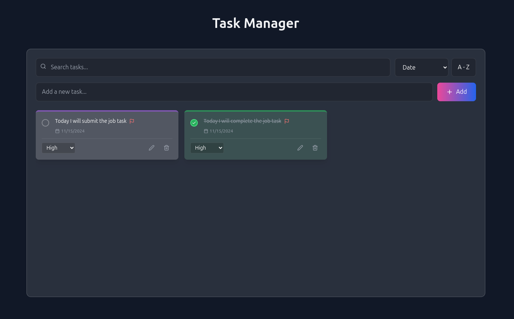

# Task Management Application

A modern, responsive task management application built with React, featuring a sleek dark mode UI with glass-morphism effects. The application provides a comprehensive solution for managing daily tasks with advanced sorting, filtering, and persistence capabilities.



## Features

### 1. Task Management
- ✨ Create, edit, and delete tasks
- ✅ Mark tasks as complete/incomplete
- 🚩 Set task priorities (High, Medium, Low)
- 📅 Automatic timestamp for each task
- 💾 Persistent storage using localStorage

### 2. Organization & Filtering
- 🔍 Real-time search functionality
- 📊 Multiple sorting options:
  - Date (newest/oldest)
  - Priority (high to low)
  - Alphabetical (A-Z/Z-A)
  - Completion status
- 🔄 Toggle sort direction

### 3. User Interface
- 🌗 Dark mode with glass-morphism effects
- 📱 Fully responsive design
- ✨ Smooth animations and transitions
- 🎨 Color-coded priority indicators
- ⚡ Real-time updates

## Getting Started

### Prerequisites
- Node.js (version 22.11.0 or higher)
- npm or yarn package manager

### Installation

1. Clone the repository:
```bash
git clone https://github.com/takbirgazi/taskManager.git
cd taskManager
```

2. Install dependencies:
```bash
npm install
# or
yarn install
```

3. Start the development server:
```bash
npm run dev
# or
yarn dev
```

4. Open your browser and navigate to:
```
http://localhost:5173
```

### Dependencies

- React
- Framer Motion (animations)
- Lucide React (icons)
- Tailwind CSS (styling)

## Usage Guide

### Adding Tasks
1. Enter task description in the input field
2. Press Enter or click the "Add" button
3. New task will appear in the grid with default medium priority

### Managing Tasks
- Click the checkbox to toggle completion
- Use the edit icon to modify task text
- Use the delete icon to remove tasks
- Select priority from the dropdown (High/Medium/Low)

### Organization
- Use the search bar to filter tasks
- Use the sort dropdown to change sorting criteria
- Click the A-Z/Z-A button to toggle sort direction

## Technical Details

### State Management
- Uses React's useState for local state management
- Implements useEffect for localStorage synchronization
- Custom hooks for specific functionalities

### Storage
- Utilizes localStorage for data persistence
- Automatic saving on any task modification
- Error handling for storage operations

### Performance Optimizations
- Debounced search functionality
- Memoized sorting functions
- Optimized re-rendering with React.memo

## Assumptions & Design Decisions

1. User Experience
   - Assumed users prefer dark mode for task management
   - Prioritized visual feedback for actions
   - Implemented glass-morphism for modern aesthetics

2. Data Storage
   - Assumed local storage is sufficient for personal task management
   - Maximum storage capacity based on browser limits
   - No backend required for basic functionality

3. Performance
   - Assumed reasonable task list size (<1000 items)
   - Optimized for modern browsers
   - Mobile-first approach for responsiveness

4. Browser Support
   - Targets modern browsers with localStorage support
   - Requires JavaScript enabled
   - Assumes CSS Grid support

## Future Enhancements

1. Planned Features
   - Task categories/tags
   - Due dates and reminders
   - Bulk actions
   - Task sharing capabilities
   - Data export/import

2. Technical Improvements
   - PWA support
   - Offline functionality
   - Cloud sync options
   - Performance optimizations

## Troubleshooting

### Common Issues

1. Tasks not persisting
   - Check if localStorage is enabled
   - Clear browser cache
   - Verify browser storage quota

2. UI Issues
   - Ensure latest browser version
   - Clear browser cache
   - Check console for errors

### Support

For support, please open an issue in the GitHub repository or contact the development team.